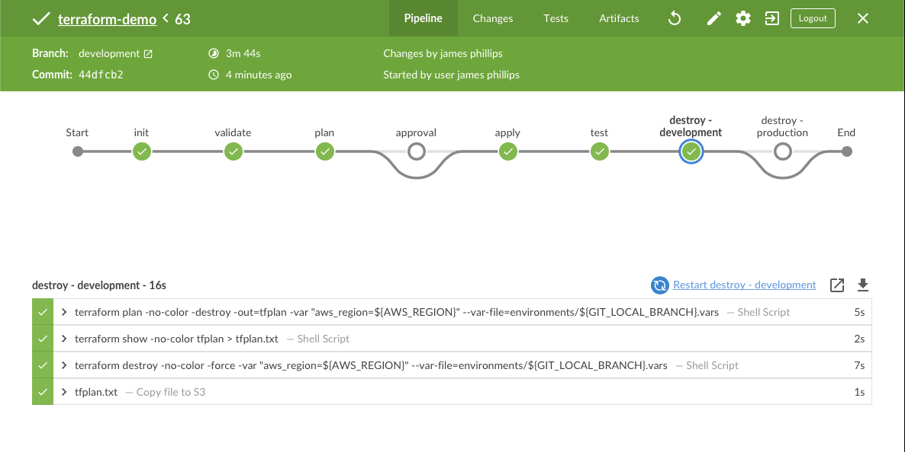
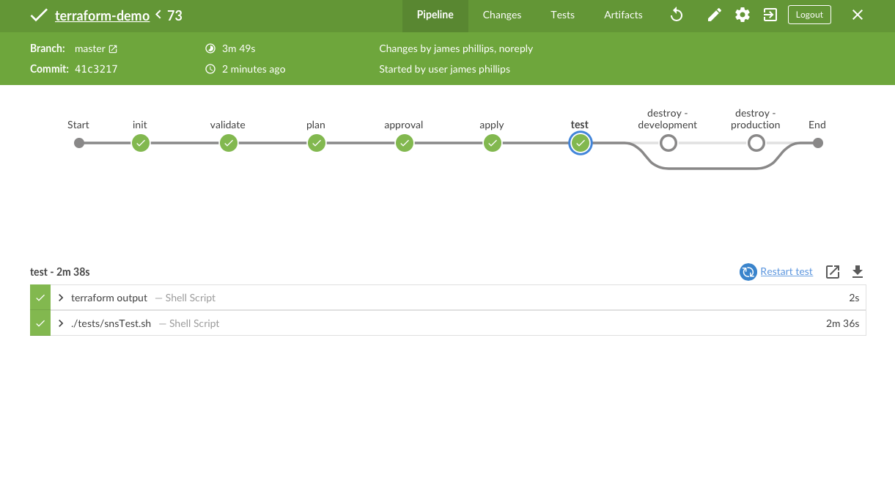
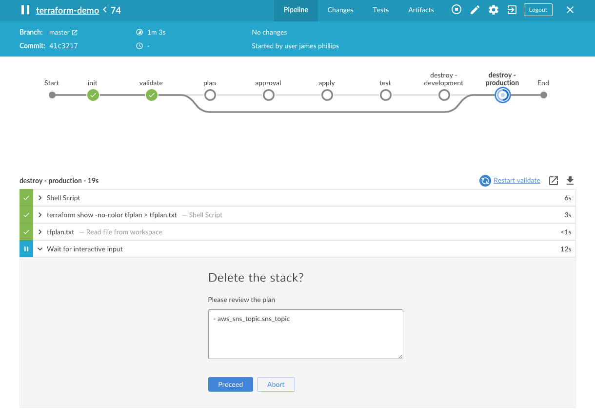
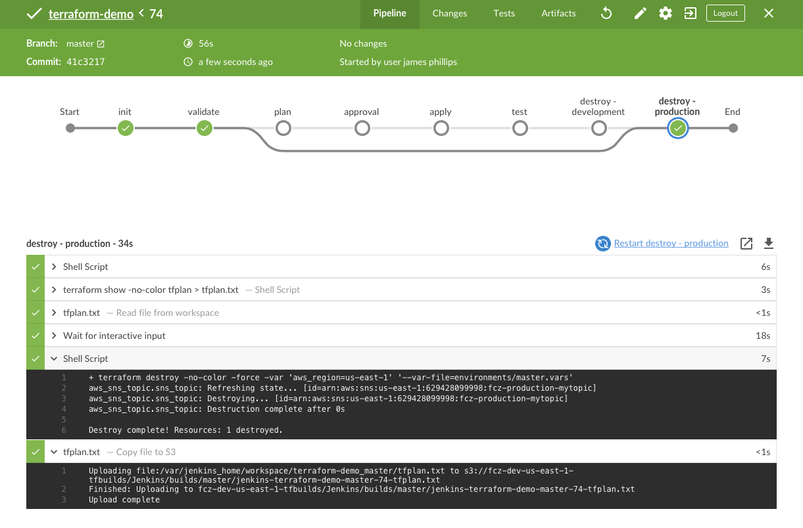

# jenkins-pipeline-demo

so yeah, probably a poorly-named repo. This demonstrates how Jenkins can be used to deploy Terraform resources in a multi-branch pipeline. CI/CD isn't my strongest skill, so it represented an opportunity for me to learn more about Jenkins.

## Pipeline

## Pipeline Approval

## ToDo

* ~add a diagram~
* ~upload stage artifacts to s3. We should probably keep artifacts, if we're pretending to have an sdlc.~
